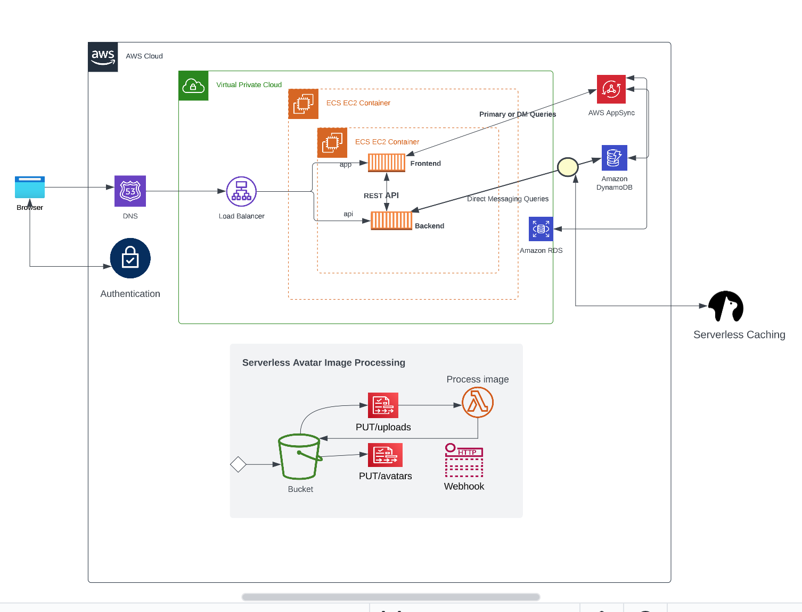
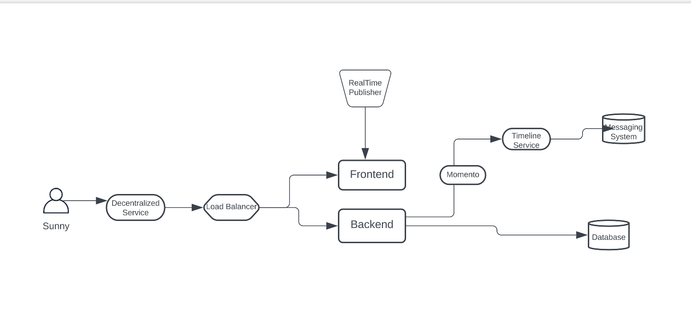
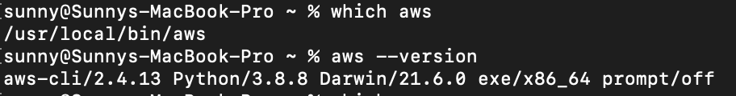

# Week 0 — Billing and Architecture

## Required Assignment/Tasks

### Recreate Logical Diagram

.[Lucid logical diagram share link].(https://lucid.app/lucidchart/ae85a0df-1771-4f2f-ac7a-27595d97518f/edit?viewport_loc=-22%2C30%2C1734%2C1166%2C0_0&invitationId=inv_c3f686e0-b533-4e85-9534-50774652ec2a)



### Recreate Conceptual Diagram
.[Lucid conceptual diagram share link].(https://lucid.app/lucidchart/60eb3ae7-3875-4389-988b-5753ed802e9b/edit?invitationId=inv_0da278d8-f060-4685-8ace-aa0002a2ff7a)



### Install AWS CLI

I installed AWS CLI via homebrew on macos terminal

```
 brew install awscli
 ```

#### Evidence of AWS CLI Installation



